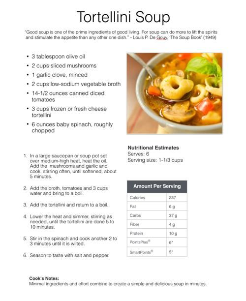

# Dish2Pass

 ## Description
  An application that generates delightful recipes for the holiday season or any type of occassion/purpose using the ingredients provided by the user.
  
  ## Table of Contents
  1. [Technologies](#technologies)
  2. [Usage](#usage)
  3. [Contribution](#contribution)
  4. [License](#license)
  5. [Questions](#questions)

  ## Technologies

  ### Front-end
  * Handlebars

  ### Back-end
  * Node
  * Express
  * Sequelize
  * ESLint

  ### Database
  * MySQL

  ### Testing
  * Travis CI

  ### Deployment
  * Heroku

  ## Usage
  The user simply navigates to the website and registers. The user then inputs the ingredients available/accessible or which he/she intends to use. Recipes are generated via an API call and the resulting recipes are saved in the favourites page.

  

  >The recipe(s) above has/have been generated with the corresponding user input of ingredients (2EDIT!). 

  ## Contribution
  - [Alexandra Stricklin](https://github.com/stricklin927) (Front-end)
  - [Brian Short](https://github.com/brianrshort) (Back-end)
  - [Imari Pickens](https://github.com/Picke1id) (Front-end)
  - [James Masaviru](https://github.com/jmasaviru) (Back-end)
  - [Tynesia Davis](https://github.com/Sivad13) (Front-end)
  
   ## License
  *  

  ## Questions
  * If you have questions, email me at: jmasaviru@gmail.com

## Links

* Video link for demonstration (2EDIT!): https://drive.google.com/file/d/1ZaSaQK2tSm5JrfMJraZW_0KiJDIBa2vk/view

* Dish2Pass GitHub repository URL: (https://github.com/jmasaviru/Dish2Pass)

* Dish2Pass Running Agenda: https://docs.google.com/document/d/1cm6-9fXuXhMhVgdy8pdm5ezz5_pK4LkmUD3iC3lq9Mo/edit